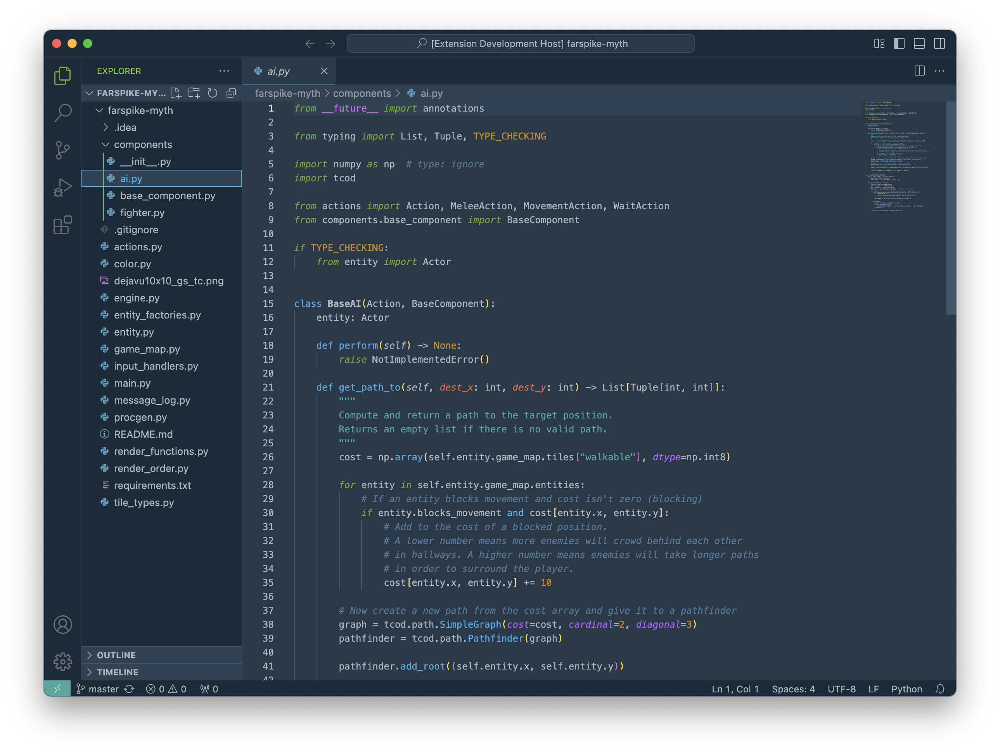

# Helion

Helion is a WCAG-compliant mid-contrast color palette inspired by [Solarized](https://ethanschoonover.com/solarized/), as well as colors that faded away — pigments whose manufacture have been lost or replaced, either due to hard-to-find materials or, more often, toxicity.

## Palette

Helion consists of 16 primary colors, with 8 base colors and 8 accents.

## Screenshots

## Colors That Faded Away

The original image that inspired this theme, whose source I can no longer find, though it may be from the Listomania magazine:

# License

See the `LICENSE.txt`.

# Bug Reports and Contributions

If in using the VS code theme you find any uncolored sections or have issues with colors or contrasts, please open a PR or contact me.

# Enjoy!