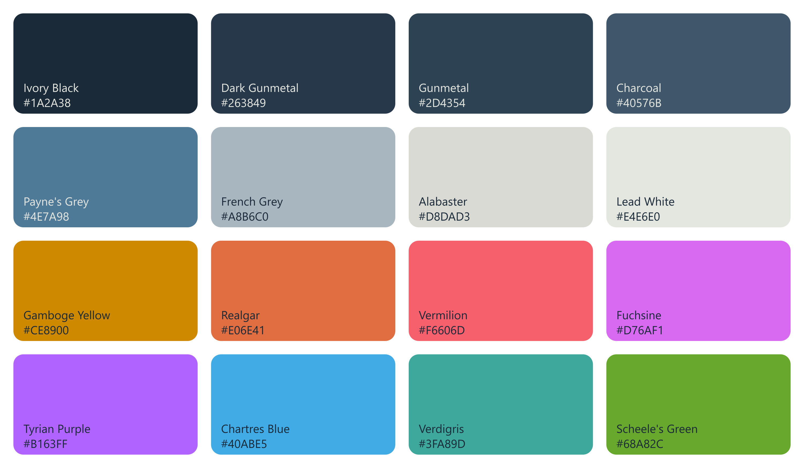

# Helion

Helion is a mid-contrast palette for IDEs, terminals, and other GUI applications. It's inspired by [Solarized](https://ethanschoonover.com/solarized/), as well as colors that faded away — pigments whose manufacture have been lost or replaced, either due to hard-to-find materials or, more often, toxicity.

I make no claim regarding this color scheme's scientific superiority. No tests have been done to ensure it is perfectly calibrated; I have not used tools to determine color relationships or complements. Hues and shades are chosen based purely on vibes and how pleasing a given color is to my own eyes.

## Palette

Presently, Helion consists of 16 **primary** colors, with 8 light variants used for emphasis.

Helion is available in several forms:
- A Visual Studio Code Theme (this repo's primary purpose)
- A `*.gpl` file for use in tools like GraphicsGale, Aseprite, or GIMP
- A `*.css` file with predefined and named CSS variables
- A `*.txt` file for paint.net's palette import 

## Screenshots

## Colors That Faded Away

The original image that inspired this theme, whose source I can no longer find, though it may be from the Listomania magazine:

# License

See the `LICENSE.txt`.

# Bug Reports and Contributions

If in using the VS code theme you find any uncolored sections or have issues with colors or contrasts, please open a PR or contact me.

# Enjoy!